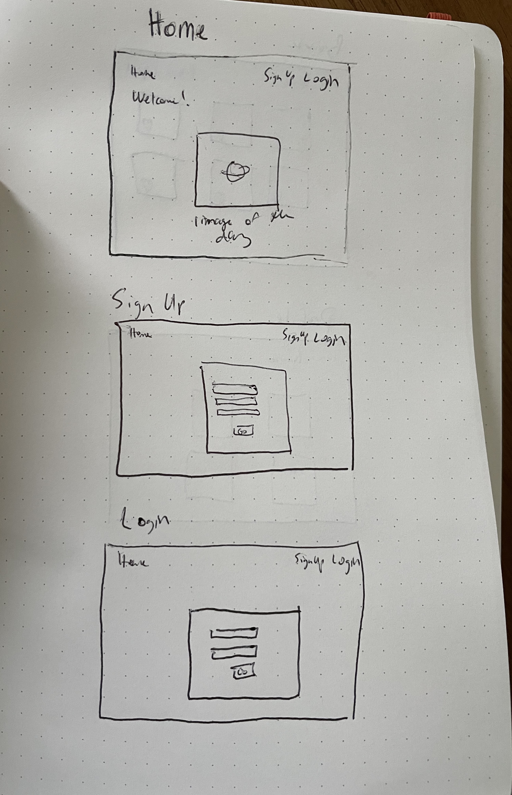
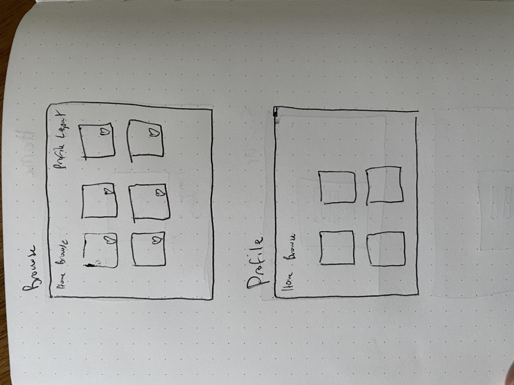

# NASA Images

## Overview

The purpose of this app is to allow users to browse and search through their astronomical images, and curate a selection of their favoites.

## Wireframes

## User Stories

- I can create a username using an e-mail and password.
- When I sign into my account after signup, I will be brought to a page with a search option and previously saved favorite images.
- I can browse 9 images at a time in a certain category, such as Earth, Mars, etc.
- When I click on an image, a description and more information about it will pop up.

## Routes Inventory

| Verb |     Path    |                Summary                |
|:----:|:-----------:|:-------------------------------------:|
|  GET |    /images    |       browse all images    |  
|  GET | /images/category | browse images of a category |   
|  POST |    /users/images/:id    |     save favorite images to profile    |  
|  POST |    /users/   |          create user account          |   
|  POST | /users/login |         login to user account         |  
|DELETE |  /users/images/:id  |     delete favorite images from profile    |  

## MVP Checklist

- User sign up and login
- Profile for remembering favorite images
- Image Browsing based on Category
- Additional details provide by hover over or clicking into image

## Stretch Goals

- Searching for more specifics in description
- Add SpaceX launch times
- Add astronomical events reminders (meteor showers, super moon, etc)
